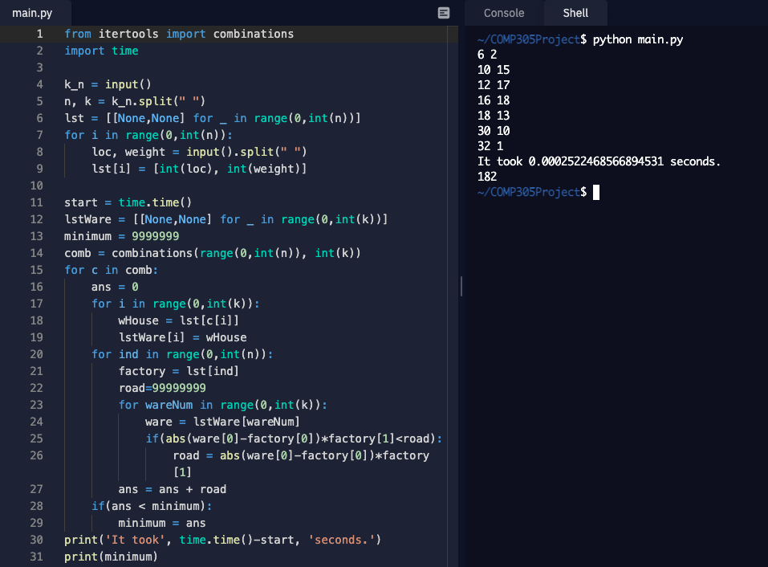

# Optimal-Location-For-Warehouses
Koç University COMP 305 Algorithms&Complexity Term Project

```non_polynomial.py```
In this solution we made use of combinations and this way we were able to give the correct output regardless of the question lenght and time. The time complexity of this method is O(n*kcomb(n,k)) but it always give the correct result meaning that it brute forces all possible warehouse locations by trying all the combinations. The space complexity is in the order of comb(n,k). We also implemented the capability to read from files and time computation related functions.

How you run this part is by opening shell and execute the following command.


This part is completed by Can Koz and Batuhan Acar.

Greedy Algorithm:
For this case, the algorithm decides if there should be selected k warehouses, it selects the best one first then select the second one according with the first one until all k warehouses are selected. The time complexity of this algorithm is O((k*n)^2) and the space complexity is O(n). This part is designed and written by Serkan Kutludağ and Yarkın Gazi.

The algorithm you designed to solve the problem, the choices of the data structures you used and your reasoning:
The trivial algorithm is to look all different combinations of the k number of warehouses from n number of factories and choose the best combination according with the cost. There are 2 different array lists for both holding the factories and warehouses with their positions adn weights. There are also another array list for holding different combinations for comb(n,k). The greedy algorithm is to select the best k different warehouses 1 by 1 in orderly according to optimal cost for the system. In this case, 3 different arraylists are used to hold the factories, warehouses and boolean container implying the index of the factory corresponds to warehouse or not. The choosing of this type of datastructure was considered since the calculating of the cost is not a complicated problem and can be directly calculated via position difference and weight. This information can be processed easily within an array list.    

The time complexity of your algorithm (and the space complexity if applicable): This can be found on the paragraphs we wrote above.

Your run times for each of the test cases: This can be found in the Jupyter Notebook with line graph visualizations. 

Further improvements that can be done as future works:

1)We thought what would be the proper action if an additional trait(building costs of warehouses) added. In this case we should also minimize the fixed cost associated with building warehouses which affect the numbers of warehouses in the problem. This problem can also implemented with greedy algorithm and inspired us to do so.[1,2]

2)Q-Learning with Neural Networks: Test cases for this problem can be augmented to trillions with the algorithms that we have generated. Number of factories,  number of warehouses, capacities can be generated randomly and an answer for each randomly generated test case can be computed using our algorithm. Once a dataset with considerable amount of test cases are created, one can train a neural network. Once that neural network achieves a considerable accuracy on unseen data which can also be augmented, that neural network can be used to determine the optimal factory or factories to be chosen as a warehouse. 

References:
[1] Laporte, Gilbert, Stefan Nickel, and Saldanha da Gama, Francisco. Location Science. Springer, 2015.
[2] https://gurobi.github.io/modeling-examples/facility_location/facility_location.html

